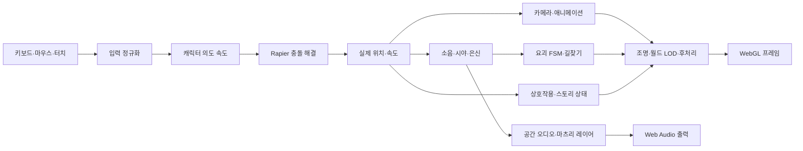
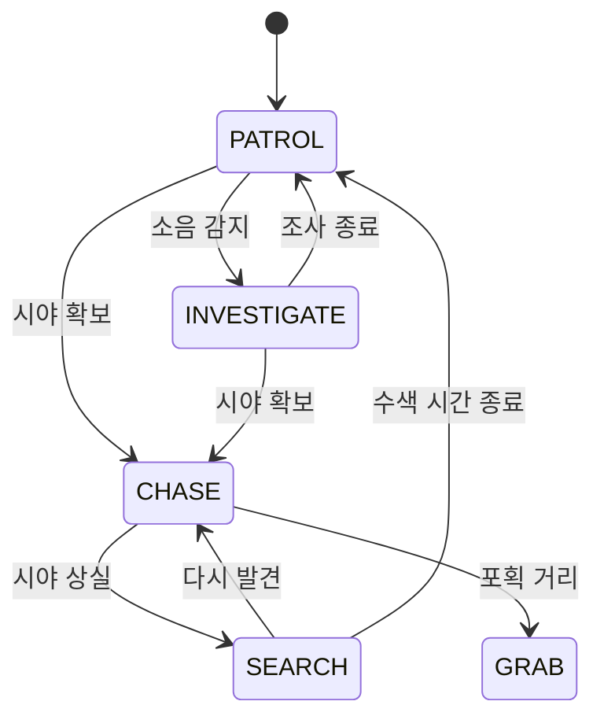

# 《피안화 — 꺼지지 않는 등불》 기술·알고리즘 명세

> 코드 기준 문서 · 2026-08-30  
> 대상 저장소: `3D_motion`  
> 런타임: 브라우저 / WebGL / TypeScript

## 0. 문서 범위와 읽는 법

이 문서는 현재 저장소에 **실제로 구현된 기법과 알고리즘**을 코드 기준으로 정리한다. 게임의 줄거리나 연출 의도를 나열하는 문서가 아니라, 그 의도가 입력·물리·AI·렌더링·오디오·상태 저장으로 어떻게 구현됐는지를 설명하는 기술 명세다.

- **런타임 기법**: 플레이 중 브라우저에서 실행되는 알고리즘
- **빌드타임 기법**: GLB, 텍스처, 오디오, 임포스터를 미리 가공하는 파이프라인
- **활성 구현**: 현재 메인 게임 흐름에서 사용하는 시스템
- **보조/샌드박스 구현**: 전투·더미처럼 저장소에는 있으나 본편의 핵심 루프와는 분리된 시스템
- 순수 모델링 수치, 대사 원문, CSS 스타일 선언처럼 “알고리즘”이 아닌 저작 데이터는 원리를 설명하는 수준으로 묶었다.

코드 주석과 실제 구현이 다른 경우에는 **실제 실행 코드**를 기준으로 했다. 예를 들어 A*의 변수명과 주석은 `heap`/“이진 힙”이지만, 현재 구현은 배열을 선형 탐색해 최소값을 꺼내는 오픈 리스트다.

## 1. 기술 스택과 전체 구조

| 영역 | 구현 |
|---|---|
| 언어·번들러 | TypeScript 5.9, Vite 8, ES2022 |
| 3D 렌더링 | Three.js r185, WebGL |
| 물리 | Rapier 3D compat |
| 후처리 | `postprocessing`, N8AO, SMAA, Bloom, ACES |
| 에셋 | glTF/GLB, Meshopt, WebP, 선택적 KTX2 |
| 오디오 | Web Audio API, HRTF, Convolver, 샘플+합성 폴백 |
| 오프라인 가공 | glTF Transform, Meshoptimizer, Sharp, Blender, FFmpeg, `toktx` |
| 저장 | `localStorage`, 선택 단서만 `sessionStorage` |
| 배포 | 정적 Vite 빌드, Cloudflare/GitHub Pages 하위 경로 대응 |

전체 실행 흐름은 다음과 같다.



중앙 조정자는 [`src/main.ts`](../src/main.ts)다. 이 파일이 월드, 캐릭터, 카메라, AI, 스토리, 오디오, UI, 품질 제어기의 생성과 프레임별 호출 순서를 관리한다.

## 2. 부팅, 로딩, 메인 루프

### 2.1 언어 결정 후 동적 부팅

게임에는 모듈 최상단에서 생성되는 아이템 이름, 팻말, 대사 데이터가 있다. 게임이 모두 로드된 뒤 언어를 바꾸면 이미 생성된 문자열만 이전 언어로 남는다. 이를 막기 위해 [`src/boot.ts`](../src/boot.ts)가 한국어/일본어를 먼저 결정하고, 그 뒤 `main.ts`를 동적으로 import한다.

현지화 함수 [`L(ko, ja)`](../src/core/i18n.ts)은 키 사전 대신 문맥상 같은 두 문장을 코드에 붙여 둔다. 저장소 접근이 실패하는 Safari 프라이빗 모드도 `try/catch`로 흡수한다.

### 2.2 로딩 진행률

GLTF 로더가 로딩 도중 새 하위 리소스를 발견하면 전체 항목 수가 증가한다. 일반적인 `loaded / total` 표시는 이때 뒤로 움직일 수 있다. 메인 로더는 이미 화면에 표시한 진행률보다 낮은 값을 보여 주지 않아 **진행 막대가 역행하지 않게** 한다.

폰트는 캔버스 기반 간판·사진·문서 텍스처가 만들어지기 전에 기다린다. 다만 네트워크 폰트 때문에 게임이 무기한 멈추지 않도록 약 3초의 상한을 둔다.

### 2.3 프레임 루프의 안전 규칙

메인 루프는 `requestAnimationFrame` 기반이다.

1. 타이틀이 보이는 동안에는 3D 업데이트와 렌더링을 멈춘다.
2. 목표 FPS보다 너무 이른 프레임은 약 2ms의 허용 오차를 두고 건너뛴다.
3. `dt`는 최대 `1/20초`로 제한해 탭 복귀나 디버거 중단 뒤 물리·AI가 한 번에 폭주하지 않게 한다.
4. 화면 크기와 실제 픽셀비를 동기화한다.
5. 입력, 물리, 스토리, AI, 월드, 카메라, 오디오, 렌더링을 순서대로 갱신한다.
6. 한 프레임의 예외는 복구를 시도하되, 연속 3회 실패하면 호환성 복구 UI를 표시한다.

WebGL 컨텍스트 손실도 별도로 감지한다. 사용자는 품질을 낮추거나 호환 모드로 재시작할 수 있다.

### 2.4 프리워밍

첫 전환·첫 등불 점등 때 셰이더를 컴파일하면 눈에 띄는 정지가 생긴다. 로딩 중 다음 항목을 미리 렌더한다.

- 일반 월드 재질
- 초칭의 꺼짐/약/강 상태
- 후처리 패스와 렌더 타깃
- 일부 숨겨진 효과 재질
- 사진/모델 아이콘처럼 GPU readback이 필요한 결과

특히 사진 캡처는 PMREM 생성과 픽셀 readback이 함께 일어나 약 수백 ms가 걸릴 수 있어 플레이 진입 전으로 옮겼다.

## 3. 공통 수학 기법

### 3.1 프레임레이트 독립 지수 감쇠

다수의 카메라, 애니메이션, 조명, AI 파라미터는 선형 보간을 고정 비율로 반복하지 않고 다음 식을 쓴다.

```text
current(t + dt) = target + (current - target) × exp(-λ × dt)
```

프레임 수가 아니라 실제 시간에 따라 수렴하므로 30fps와 120fps에서 비슷한 감각을 유지한다. 각도는 `[-π, π]`로 차이를 래핑한 뒤 같은 감쇠를 적용한다. 구현은 [`src/core/math.ts`](../src/core/math.ts)에 있다.

### 3.2 Smoothstep과 Catmull–Rom

- `smoothstep`: 카메라 도입, 시간대 전환, 거리별 오디오 게인, LOD 페이드에 사용한다.
- `Catmull–Rom`: 시퀀서의 카메라 위치와 시선 경로를 부드럽게 잇는다.
- 삼차 ease-out: 도로타보의 상승·침강처럼 빠르게 시작하고 끝에서 멈추는 동작에 사용한다.

### 3.3 결정론적 의사난수

프로시저럴 지형, 나무, 대나무, 묘석, 까마귀, 꽃, 텍스처에는 xorshift 계열 시드 난수를 사용한다. 같은 빌드와 시드에서는 배치가 재현되므로 디버깅과 장면 연속성이 좋아진다. 반대로 요괴 타이밍·오디오 변주처럼 매 플레이의 불확실성이 필요한 곳은 런타임 난수를 사용한다.

## 4. 입력 시스템

### 4.1 키보드·마우스

[`src/core/input.ts`](../src/core/input.ts)는 지속 입력과 “이번 프레임에 처음 눌림”을 분리한다. 마우스 델타와 휠은 프레임 동안 누적하고 소비 시 0으로 돌린다.

- 포인터 락 중에는 `movementX/Y`를 사용한다.
- 포인터 락이 불가능한 환경에서는 드래그 오빗으로 폴백한다.
- 짧은 클릭과 드래그를 이동량 임계값으로 구분한다.
- `setPointerCapture`/`releasePointerCapture`의 브라우저 예외는 조작을 깨지 않도록 흡수한다.
- 키보드와 터치 축을 더한 뒤 벡터 길이를 1로 정규화해 대각선이 빨라지지 않게 한다.

### 4.2 터치

[`src/core/touch.ts`](../src/core/touch.ts)는 포인터 이벤트 하나로 멀티터치를 처리한다.

- 왼쪽 절반: 위치가 고정되지 않은 가상 조이스틱
- 오른쪽 절반: 시점 드래그
- 별도 버튼: 점프, 걷기 토글, 공격, 시점, 인벤토리
- 조이스틱 반경을 넘는 입력은 원 위로 클램프한다.
- 12% 데드존을 제거한 뒤 남은 구간을 다시 `0..1`로 리매핑한다.

## 5. 캐릭터 물리와 이동

### 5.1 키네마틱 캡슐

플레이어는 반지름 `0.35m`, 원통 반높이 `0.5m`인 키네마틱 캡슐이다. 전체 높이는 약 `1.7m`다. Rapier에 이동 의도를 넘기고 충돌 해결 후 실제 변위를 돌려받는다.

[`src/character/controller.ts`](../src/character/controller.ts)의 이동 순서는 다음과 같다.

1. 카메라 yaw에서 전방/오른쪽 기저 벡터를 계산한다.
2. 입력 축을 월드 이동 방향으로 변환한다.
3. 지상 가속, 감속, 공중 제어율을 지수 감쇠로 적용한다.
4. 자체 중력과 점프 수직 속도를 갱신한다.
5. Rapier 캐릭터 컨트롤러가 계단, 경사, 벽 미끄러짐을 해결한다.
6. 실제 변위에서 `actualVelocity`를 다시 계산한다.
7. 벽에 막힌 축의 의도 속도도 잘라 벽에서 계속 관성이 쌓이지 않게 한다.

### 5.2 점프 감각

원하는 점프 높이 `h`와 중력 `g`에서 초기 속도를 역산한다.

```text
v_y = sqrt(2 × g × h)
```

추가 감각 보정은 다음과 같다.

- **코요테 타임**: 발판을 막 떠난 짧은 시간에도 점프 허용
- **점프 버퍼**: 착지 직전 누른 점프를 잠시 기억
- **점프 컷**: 버튼을 일찍 놓으면 상승 속도를 줄여 낮은 점프 허용
- **ground stick/snap**: 완만한 내리막에서 캡슐이 뜨지 않게 지면에 붙임
- **landing lock**: 착지 직후 상태가 튀는 것을 억제
- **terminal velocity**: 낙하 속도 하한을 제한

### 5.3 물리 질의

[`src/core/physics.ts`](../src/core/physics.ts)는 정적 박스 생성, 반복 사용하는 Ray 객체, 차폐 검사를 제공한다. `rayBlocked`는 광선의 시작점·끝점과 너무 가까운 자기 충돌을 무시하고, 필요하면 두 강체까지 제외한다. 지형, AI 시야, 카메라 충돌, 오디오 차폐가 같은 물리 월드를 공유한다.

## 6. 카메라와 시점 연출

### 6.1 3인칭 스프링 암

[`src/camera/thirdPerson.ts`](../src/camera/thirdPerson.ts)는 다음 계층으로 카메라를 계산한다.

- 플레이어를 따라가는 피벗 위치의 지수 스프링
- 공중에서는 수직 추종을 느슨하게 해 점프의 높이를 보이게 함
- yaw/pitch 오빗과 어깨 오프셋
- 구형 shape-cast로 벽까지의 허용 거리 계산
- 충돌 시 빠르게 당기고, 벽에서 나올 때 천천히 복원하는 비대칭 스프링
- 이동 속도에 따른 FOV 확장
- 사건용 흔들림과 “관심 지점으로 당기기”

강제 시선은 입력을 완전히 잠그지 않고 목표 yaw/pitch 쪽으로 부드럽게 끌어, 플레이어가 연출 중에도 주도권을 잃었다고 느끼지 않게 한다.

인트로 오빗은 smoothstep으로 진행하고 종료 시 현재 카메라의 yaw/pitch/거리를 일반 카메라가 인계한다. 따라서 컷신 종료 순간 기본 시점으로 튀지 않는다.

카메라가 캐릭터에 너무 가까워지면 내부 메시를 숨긴다. 임계값을 하나만 쓰지 않고 숨김/복원 거리를 다르게 둔 히스테리시스로 깜빡임을 막는다. 초칭 루트와 실제 광원은 계속 남긴다.

### 6.2 과거 장면용 1인칭 리그

[`src/story/firstPerson.ts`](../src/story/firstPerson.ts)는 어린 미오의 눈높이, 달리기 bob, 좌우 roll, 착지 충격, 속도 기반 FOV를 만든다.

- 한 걸음 거리를 `1.02m`로 보고 `걸음 빈도 = 속도 / 한 걸음 거리`로 계산한다.
- 발소리는 보이지 않는 애니메이션 발목이 아니라 카메라 bob의 최저점 위상에 연결한다.
- 정면에서 일정 각도 이상 돌아보면 입력 저항이 커지고 최대 회전각에서 멈춘다.
- `lookBack` 값으로 “뒤돌아보지 말라”는 금기를 스토리 조건으로 바꾼다.
- 손에 끌림, 넘어짐, 손을 놓침을 연속 파라미터로 만들어 카메라와 사요 연출이 공유한다.
- 버스처럼 물리 지형 밖에 있는 장면은 컨트롤러 대신 별도 anchor에 카메라를 고정한다.

### 6.3 시네마틱 시퀀서

[`src/story/sequencer.ts`](../src/story/sequencer.ts)는 카메라 위치와 look-at을 Catmull–Rom 곡선으로, FOV는 키 시간 사이 선형 보간으로 계산한다. 자막, 페이드, 함수 호출 이벤트를 시간축에서 실행한다.

Space를 약 `0.7초` 누르면 건너뛸 수 있다. 이때 단순히 마지막 프레임으로 이동하지 않고 남은 함수 이벤트를 실행해, 문 열기·아이템 상태 같은 최종 월드 상태가 정상 재생과 같아지게 한다. 따라서 시퀀스 콜백은 여러 번 불려도 같은 결과가 되는 멱등성을 전제로 한다. 개발용 스크러빙은 부작용 이벤트를 재실행하지 않고 카메라만 이동한다.

## 7. 애니메이션, 리타기팅, 절차적 포즈

### 7.1 상태 머신과 크로스페이드

[`src/character/animator.ts`](../src/character/animator.ts)는 `idle / walk / run / jump / fall / variation` 상태를 실제 속도와 접지 상태로 고른다. 전환은 AnimationAction 크로스페이드로 연결한다.

발소리는 클립 시간만 믿지 않는다. 최종 포즈의 발 위치와 지면 접촉을 함께 보고, 애니메이션 위상의 지정된 발이 실제로 내려왔을 때 표면별 소리를 낸다.

### 7.2 클립 순환 이음매 보정

걷기·달리기 클립의 첫 쿼터니언 `q0`와 마지막 `qN`이 다르면 반복 경계에서 관절이 튄다. [`src/character/model.ts`](../src/character/model.ts)는 다음 보정량을 구한다.

```text
D = q0 × inverse(qN)
q'i = slerp(I, D, i / (N - 1)) × qi
```

마지막 프레임으로 갈수록 보정을 누적해 마지막 포즈가 첫 포즈와 이어지게 한다.

### 7.3 월드 공간 휴식 자세 기반 리타기팅

[`src/story/retarget.ts`](../src/story/retarget.ts)는 소스와 타깃 뼈 이름을 연결한 뒤, 휴식 자세 차이를 월드 공간에서 보정한다.

```text
worldTarget(b)
  = worldSource(b)
  × inverse(restWorldSource(b))
  × restWorldTarget(b)

localTarget(b)
  = inverse(worldTarget(parent(b)))
  × worldTarget(b)
```

루트 이동은 두 스켈레톤 높이 비율로 스케일한다. 부모의 축 방향이 다른 리그에서도 단순 로컬 쿼터니언 복사보다 안정적이다.

### 7.4 애니메이션 레이어와 절차 보정

상체 레이어는 뼈 이름 정규식으로 필요한 트랙만 남긴다. 믹서가 어떤 트랙을 건너뛸 때 이전 프레임의 절차 포즈가 누적되지 않도록, 기준 포즈를 캐시했다가 매 프레임 믹서 전에 복원한다.

믹서 계산 뒤에는 다음 보정을 덧씌운다.

- 척추·머리 pitch와 roll
- 쇄골과 어깨의 자세 보정
- 손목 roll
- 가속도 기반 몸 기울기
- 착지 squash 스프링
- 걷기 중 팔의 월드 방향 제한
- 웅크리기 포즈 레이어
- 공격 모션의 절차적 상체 회전

팔 제한은 목표 월드 방향과 현재 방향 사이의 쿼터니언 델타를 부모 로컬 공간으로 변환해 slerp한다. 원본 애니메이션의 전후 swing은 보존하면서 비정상적인 옆 벌어짐만 줄인다.

### 7.5 장비 부착

장비는 명명된 손 뼈에 마운트한다. 리그의 로컬 축을 고정 가정하지 않고, 엉덩이→손의 월드 방향 같은 해부학적 관계에서 “몸 바깥쪽”을 구한다. 모델 교체 시 축 규약이 달라도 부착 방향을 유지하기 위한 방식이다.

## 8. 초칭: 핵심 게임 메커닉과 조명 알고리즘

[`src/light/chochin.ts`](../src/light/chochin.ts)는 단순 손전등이 아니라 시야·AI·오디오·공포 연출을 연결하는 핵심 시스템이다.

### 8.1 3단계 밝기와 위험

초칭은 `0=꺼짐`, `1=약`, `2=강` 상태다. 밝을수록 실제 광량과 가시 범위가 늘지만, AI의 감지 거리 배율도 커진다. 기본 설정 주석상 배율은 약 `0.6 / 1.4 / 3.0`이다. 즉 “보기 위해 켠 빛이 자신을 드러낸다”는 선택을 수치 시스템으로 만든다.

### 8.2 손 아래 진자

손 뼈의 부모 로컬 공간에서 원하는 월드 업 방향을 역변환해 등롱이 캐릭터 자세와 무관하게 아래로 매달리게 한다. 흔들림은 감쇠 스프링이다.

```text
targetSwing = sin(t × (3.2 + speed × 0.8)) × (0.05 + speed × 0.035)
velocity += (targetSwing - swing) × 42 × dt - velocity × 7.5 × dt
swing += velocity × dt
```

최종 회전은 지수 지연을 둔 slerp로 손의 급격한 방향 전환을 늦게 따라간다.

### 8.3 위협 반응형 불꽃

여러 주파수의 사인파를 합쳐 반복이 잘 보이지 않는 flicker를 만들고, 위협도가 높을수록 진폭·속도·순간 dip 확률을 키운다. 목표 광량으로는 다시 감쇠해 갑작스러운 숫자 변화가 깜빡임처럼 보이지 않게 한다.

### 8.4 그림자 안정성

초칭의 점광원은 큐브 섀도맵을 쓴다. 매 프레임 6면을 렌더하지 않고 약 30Hz로 갱신한다. 중요한 안정성 규칙은 다음과 같다.

- 광원을 끌 때 `visible`이나 `castShadow`를 토글하지 않고 intensity만 0으로 만든다.
- 섀도맵 객체를 한 번 생성한 뒤 유지한다.
- 이렇게 해야 셰이더의 `samplerCubeShadow` 구성과 실제 텍스처 상태가 어긋나 표준 재질 전체가 검게 사라지는 드라이버 문제를 피한다.

## 9. 길찾기와 공통 AI 감각

### 9.1 내비게이션 격자 베이크

[`src/ai/navgrid.ts`](../src/ai/navgrid.ts)는 게임 시작 시 `1.5m` XZ 격자를 만든다.

각 셀은 다음 조건을 통과해야 걷기 가능하다.

- 지형 경사 `≤ 0.85`
- 지면 `h + 0.9m`에 둔 캡슐이 고정 Rapier 콜라이더와 겹치지 않음
- 밀 수 있는 동적 소품은 경로를 영구 차단하지 않으므로 무시

목표 셀이 막혀 있으면 체비쇼프 반경 1부터 6까지 정사각 나선을 돌며 가장 가까운 통행 셀을 찾는다.

### 9.2 8방향 A*

[`src/ai/astar.ts`](../src/ai/astar.ts)는 직교 이동 비용 `1`, 대각선 비용 `√2`인 8방향 A*다. 대각선 이동 시 인접한 두 직교 셀이 모두 열려 있어야 하므로 벽 모서리를 비집고 통과하지 않는다.

휴리스틱은 octile distance다.

```text
h = max(dx, dz) + (sqrt(2) - 1) × min(dx, dz)
```

안전 상한은 20,000회다. 경로를 복원한 뒤 같은 방향으로 연속된 셀을 중간 점에서 제거해 직선 구간을 합친다.

현재 오픈 리스트는 이름과 달리 이진 힙이 아니다. 배열에서 매번 최소 `f`를 선형 탐색하므로, 복잡도는 최악의 경우 힙 구현보다 크다. 현재 맵 크기와 낮은 재탐색 빈도에서는 단순성을 택한 구현이다.

### 9.3 공정한 감각 모델

[`src/ai/senses.ts`](../src/ai/senses.ts)는 요괴에게 플레이어 좌표를 직접 제공하지 않고 **시야와 소음 결과만** 제공한다.

소음은 4초간 기억하며, 들리는 사건 중 다음 점수가 가장 큰 것을 고른다.

```text
score = strength
      × (1 - distance / radius)
      × (1 - age / 4)
```

감지 거리는 다음과 같다.

```text
detectionRange
  = baseDetection
  × lanternMultiplier
  × (moving ? 1.2 : 1)
  × extraMultiplier
```

시야는 전방 90도, 즉 좌우 45도다. 다만 2m 이내는 뒤쪽도 감지한다. 마지막으로 요괴 눈에서 플레이어 가슴까지 Rapier raycast를 쏴 나무, 토리이, 벽 등의 차폐를 확인한다.

## 10. 추격자 FSM

[`src/ai/hunter.ts`](../src/ai/hunter.ts)의 공통 추격자는 다음 상태를 가진다.



핵심 공정성 규칙은 다음과 같다.

- `CHASE` 중에도 실제 시야를 잃으면 마지막 목격 지점만 기억한다.
- 소음을 들으면 실제 플레이어가 아니라 소음 위치를 조사한다.
- 첫 발견 직후 약간의 mercy 시간을 두어 즉시 잡히지 않게 한다.
- 추격 중에는 약 `0.7초`, 그 외에는 약 `1.6초` 간격으로 경로를 다시 계산한다.
- 5m 안의 근접 추격은 격자 셀 중앙에 멈추는 문제를 피하려 직접 조향한다.
- 이동은 목표 속도로 감쇠하며 지형 높이를 계속 따라간다.
- 멀리 있는 요괴는 초칭 큐브 섀도맵 렌더에서 제외한다.

## 11. 요괴별 전용 알고리즘

### 11.1 도로타보: 추격자가 아닌 영역 규칙

[`src/ai/dorotabo.ts`](../src/ai/dorotabo.ts)는 `HIDDEN → RISING → ACTIVE → SINKING` FSM이다.

- 논 안에서 움직이면 노출 게이지가 빠르게, 멈춰 있으면 천천히 오른다.
- 논 밖에서는 게이지가 초당 0.6씩 감소한다.
- 임계값에 도달하면 플레이어 주변 2.6m 원 위에서 논인 위치를 최대 10회 찾는다.
- 출현하면 주기적으로 반경 설정값의 강한 소음을 발생시켜 공통 추격자를 부른다.
- 직접 즉사시키지 않고 가까이 오면 플레이어를 논 밖 방향으로 밀어낸다.
- 스스로는 `paddyMask` 경계 밖으로 나가지 않는다.
- 플레이어가 논을 나가면 가라앉고 쿨다운에 들어간다.

이 설계는 벼 은신을 금지하지 않으면서 장기 남용에 비용을 붙인다.

### 11.2 유리: 시야에 멈추는 Weeping Angel

[`src/ai/yuri.ts`](../src/ai/yuri.ts)는 `dormant / haunt / stalk` 상태를 가진다.

- 카메라 시야 안이고, 약 12m 이내이며, 카메라→머리 ray가 막히지 않으면 “보고 있음”이다.
- 보고 있는 동안 이동하지 않고, 보지 않을 때만 접근한다.
- 소리도 역으로 설계해, 보이지 않을 때 허밍과 물체 긁는 소리를 내고 보이면 멈춘다.
- 키네마틱 캡슐로 직접 이동한 뒤 막히면 좌우 약 `±67.5°` 후보 방향을 평가해 미끄러진다.
- 학교 내부 경계를 벗어나지 않는다.
- 첫 haunt 접촉은 즉사 대신 사라졌다 멀리 재배치되고, stalk 접촉만 포획한다.
- 스폰은 대략 5~11.5m 후보를 검사하고 시야와 거리 조건을 만족하는 위치를 고른다.

### 11.3 우물 여자: 시간 위상과 청각 퍼즐

[`src/ai/wellWoman.ts`](../src/ai/wellWoman.ts)는 `dormant / submerged / risen` 상태를 번갈아 운용한다.

- 수면 아래와 물 위 활동 시간을 교대한다.
- 이동 가능 영역을 우물 물방으로 제한하고 벽감은 안전지대로 둔다.
- 공간 음원의 위치가 곧 적의 방향 정보가 된다.
- 던진 자갈은 소리 목표를 바꾸는 distraction이다.
- 아이 목소리 유인과 질문 응답은 추적 배율·장면 결과를 바꾼다.
- 동전을 들고 있으면 상승 시간이 길어지고 속도도 증가한다.
- 사다리를 올라갈 수 있는지는 상승 상태, 교란, 경직 여부로 계산한다.
- 시네마틱 hold와 실제 AI 상태를 분리해 컷신 중 논리가 폭주하지 않게 한다.

### 11.4 로쿠로쿠비: 32본 절차적 목 체인

[`src/ai/rokurokubi.ts`](../src/ai/rokurokubi.ts)는 `dormant / watch / hunt / coil / lunge / settle / retract` FSM과 32개 목 뼈의 절차 애니메이션을 결합한다.

주요 기법은 다음과 같다.

- 목 끝으로 갈수록 커지는 사인파 envelope
- 마지막 약 38% 뼈에 집중되는 갈고리(hook) 가중치
- reach, hook 각도, 파동 진폭·속도의 지수 감쇠
- 모델 로컬 공간에서 머리 목표를 향한 총 굽힘각을 여러 뼈에 분배
- lunge 진행은 smoothstep으로 가감속
- 굽힘 평면의 외적이 0에 가까워지는 특이점에서는 이전 프레임 축을 유지하고 slerp해 갑작스러운 뒤집힘 방지
- 머리 회전은 매 프레임 rest 자세에서 다시 만들어 360도 roll 누적 방지
- 머리 swing은 약 105도로 제한
- 현재와 이전 머리 끝 사이 선분에서 플레이어까지의 최소 거리로 충돌을 검사해 빠른 돌진의 터널링 방지
- 보조 캡슐 판정을 함께 사용
- 머리카락과 팔에는 별도 secondary motion 적용

플레이어가 실제로 후퇴하고 있을 때만 원거리 공격 압력이 증가한다. 봉인 부적은 도달 거리를 줄이며 역순으로 결속되는 퍼즐 상태와 연결된다.

### 11.5 공통 추격자 변형

하샤쿠사마·키츠네 계열은 공통 Hunter의 감각·경로·추격 FSM을 공유하되 모델, 속도, 연출, 출현 시점과 추가 배율을 다르게 설정한다. 공통 기반을 공유함으로써 “벽 너머에서 플레이어 좌표를 아는” 예외 AI가 생기지 않게 한다.

## 12. 은신과 상호작용

### 12.1 은신 판정

[`src/game/hiding.ts`](../src/game/hiding.ts)는 별도 숨기 버튼 없이 장소·자세·속도로 판정한다.

| 장소 | 조건 |
|---|---|
| 피안화 군락 | 자세 무관, 군락 내부 |
| 벽장 | 웅크림 + 벽장 내부 |
| 노점 아래 | 웅크림 + 중심 1.3m 이내 |
| 벼 사이 | 웅크림 + 속도 0.25m/s 미만 + 논 마스크 |

“은신은 도주의 시작이 아니라 마무리”라는 규칙 때문에, Hunter가 `CHASE` 중이고 마지막 목격 후 1초가 지나지 않았다면 장소 조건을 만족해도 그 Hunter에게는 보인다. 먼저 시야를 끊어야 한다.

### 12.2 거리·홀드 상호작용

[`src/game/inspect.ts`](../src/game/inspect.ts)는 활성 상호작용 지점 중 플레이어와 가장 가까운 것을 선택한다. 대상이 바뀌면 홀드 진행을 초기화한다.

```text
누르는 동안: progress += dt / requiredHold
놓는 동안:   progress -= 2 × dt / requiredHold
```

대화·컷신·인벤토리처럼 입력 우선순위가 높은 UI가 열리면 월드 상호작용을 차단한다.

## 13. 봉납 규칙과 난이도 곡선

[`src/game/rules.ts`](../src/game/rules.ts)는 7개의 공물 상태를 `locked / open / carried / offered`로 관리한다.

진행은 완전 선형이 아니라 반고정 그룹이다.

```text
스즈 → 빗 → 동전 → [게다, 카가미] → 후다
```

앞 그룹이 봉납돼야 다음 그룹이 열린다. 사요 관련 항목은 내러티브 상태로 별도 처리한다.

- 봉납 수가 늘수록 Hunter 속도가 상승한다.
- 3개 이상 봉납 시 감지 배율이 약 `1.3`이 된다.
- 공물을 운반 중이면 감지 배율이 추가로 약 `1.5`가 된다.
- 4개 이상 봉납 시 두 번째 추격자가 활동한다.
- 사망하면 운반 중 아이템은 떨어지지만 이미 봉납한 진행은 보존한다.
- 후다에는 단순 수락이 아닌 거부/스토리 분기가 있다.

공물 표식 광원은 객체를 삭제·생성하지 않고 intensity만 바꾼다. 이는 점광원 수 변화로 인한 셰이더 재컴파일을 피하기 위한 렌더링 규칙이기도 하다.

## 14. 스토리 상태와 내러티브 시스템

### 14.1 35개 ACT와 단계 정규화

[`src/story/phases.ts`](../src/story/phases.ts)는 35개 ACT를 큰 phase로 묶는다. 저장 데이터가 이전 형식이어도 ACT 범위를 클램프하고 chapter에서 ACT를 복원하는 방어적 정규화를 거친다.

### 14.2 체크포인트 저장

[`src/story/flags.ts`](../src/story/flags.ts)는 `StoryFlags`와 최소한의 `StoryWorldState`를 저장한다. AI의 순간 위치, 현재 소음, 프레임 중간 애니메이션 같은 불안정 상태는 저장하지 않고, 다시 구성 가능한 안정된 체크포인트만 남긴다.

- 로드 시 타입과 범위를 검증한다.
- 배열은 중복·알 수 없는 ID를 제거한다.
- 저장/복원 시 깊은 복사로 런타임 객체와 저장 스냅샷의 공유 참조를 막는다.
- 규칙 진행 복원도 유효한 아이템 ID만 허용한다.

### 14.3 대화, 선택지, 퀘스트

[`src/story/dialogue.ts`](../src/story/dialogue.ts)는 대사 큐, 타이핑/표시 시간, 선택지를 관리한다. [`src/story/quests.ts`](../src/story/quests.ts)는 현재 목표와 완료 상태를 HUD에 반영하고, 공포 상태에서는 글리치 시각 효과를 적용한다.

### 14.4 증거 저널과 선택 단서

[`src/story/evidenceJournal.ts`](../src/story/evidenceJournal.ts)는 단순 발견 개수 대신 특정 단서 조합에서 이론을 도출한다. [`src/story/optionalForeshadows.ts`](../src/story/optionalForeshadows.ts)의 선택적 전조는 `sessionStorage`에만 기록해 정식 진행 플래그를 오염시키지 않는다.

### 14.5 실제 입력을 확인하는 튜토리얼

[`src/story/controlsTutorial.ts`](../src/story/controlsTutorial.ts)는 키를 눌렀는지만 보는 대신 실제 이동축과 시점 델타를 확인한다. 장치나 자동화 환경에서 영원히 막히지 않도록 각 단계에 시간 기반 탈출 조건도 둔다.

### 14.6 로컬 플레이테스트 텔레메트리

[`src/story/telemetry.ts`](../src/story/telemetry.ts)는 네트워크로 전송하지 않고 브라우저 로컬에 최근 24개 세션만 저장한다.

- 실제 활성 플레이 시간
- ACT별 체류 시간과 방문 수
- 증거 발견 순서와 시간
- 사망 위치/횟수
- `dt`는 최대 0.1초로 제한
- 15초 주기, `pagehide`, 탭 숨김 시 flush

이는 분석용 최소 계측이며 외부 사용자 추적 SDK는 사용하지 않는다.

## 15. 렌더투텍스처와 서사적 광학

### 15.1 손거울: 다른 시간의 별도 씬

[`src/story/handMirror.ts`](../src/story/handMirror.ts)는 실시간 반사 대신 “과거의 방”으로 구성된 별도 mirror scene을 같은 카메라 위치에서 512² 렌더 타깃에 그린다. 거울을 들었을 때만 렌더한다.

WebGL 픽셀을 CPU로 읽으면 행 방향이 뒤집혀 있으므로 행을 역순 복사한다. `putImageData`는 canvas transform을 무시하므로, 오프스크린 캔버스에 먼저 쓴 뒤 표시 캔버스에서 X축 `-1` 스케일로 좌우 반전한다.

### 15.2 와쿄: GPU 안에서 합성하는 후방 거울상

[`src/story/wakyoView.ts`](../src/story/wakyoView.ts)는 메인 카메라를 로컬 Y축으로 180도 돌려 뒤쪽의 mirror scene을 렌더한다. 결과는 CPU readback 없이 GPU 텍스처로 유지하고, 실제 DOM 렌즈 위치에 viewport/scissor를 맞춰 원형 셰이더 오버레이로 합성한다.

- fragment shader에서 X UV를 뒤집는다.
- 원 가장자리는 smoothstep alpha로 자른다.
- 채도와 대비를 약간 낮춰 다른 세계의 질감을 준다.
- 카메라나 장면 자체를 음수 스케일하지 않아 삼각형 winding/backface culling 반전을 피한다.

### 15.3 사진과 모델 아이콘

[`src/story/photo.ts`](../src/story/photo.ts)와 [`src/story/modelSprite.ts`](../src/story/modelSprite.ts)는 GLB를 직교 카메라로 투명 렌더 타깃에 찍어 UI 이미지를 만든다.

- 바운딩 박스에서 가장 얇은 축을 찾아 납작한 소품의 법선으로 사용한다.
- 남은 축 중 긴 축을 화면 위쪽으로 삼아 모델 제작 축에 덜 의존한다.
- `readRenderTargetPixels` 후 Y행을 뒤집어 PNG data URL로 변환한다.
- 임시 렌더 타깃, 지오메트리, 재질, 텍스처를 명시적으로 dispose한다.
- 사진 얼굴의 얼룩은 모델 공간 비율 상수를 아이콘과 3D 데칼이 공유해 서로 어긋나지 않게 한다.

## 16. 프로시저럴 월드 생성

### 16.1 Simplex noise와 fBm

[`src/world/noise.ts`](../src/world/noise.ts)는 Stefan Gustavson 방식의 2D Simplex noise를 시드 셔플로 구현한다. 각 심플렉스 꼭짓점 기여는 거리 감쇠 `t⁴`와 그래디언트 내적을 곱하고 세 기여를 합산한다.

fBm은 옥타브마다 주파수를 `lacunarity`배, 진폭을 `gain`배 바꿔 합산한 뒤 진폭 합으로 정규화한다.

```text
fbm(x, y) = Σ amplitude_o × noise(x × frequency_o, y × frequency_o)
            / Σ amplitude_o
```

### 16.2 히가사토 지형

[`src/world/village/ground.ts`](../src/world/village/ground.ts)는 약 190~200m 규모, 1m 간격 지형을 만든다.

- Simplex fBm 기본 높이
- 산자락, 외곽 림, 계곡 함수
- 경로 polyline의 가장 가까운 점과 진행률 계산
- 경로 중심 높이로 smoothstep 블렌딩해 걸을 수 있는 길 생성
- 집·광장 같은 site shelf는 가장 가까운 길 높이에서 유도해 절벽과 순환 의존 방지
- 논 셀은 결정론적으로 배치하고 건물·길 제외 영역을 피함
- 논두렁 틈은 정수 hash로 결정
- 높이필드 경사만으로 넘을 수 있는 논 벽은 Rapier 정적 박스로 추가 차단

Rapier heightfield가 기대하는 메모리 순서와 렌더 지형 배열 방향이 달라, 물리 생성 시 행·열을 전치한다.

### 16.3 경로 평탄화

각 정점에서 polyline 모든 구간에 대한 최근접점을 구하고, 길 중심까지의 거리 `d`를 이용한다.

```text
blend = 1 - smoothstep(roadWidth, roadWidth + blendWidth, d)
height = lerp(terrainHeight, routeBaseHeight, blend)
```

경로별 bounding box를 먼저 검사해 불필요한 선분 투영을 줄인다.

### 16.4 시각 전용 원거리 지형

실제 물리 지형 바깥에는 경계 정점과 정확히 이어지는 apron ring을 만든다. Chebyshev 반경과 절차적 `farLift`로 산 능선을 만들지만 물리·내비게이션에는 넣지 않는다. 플레이 가능 영역 비용을 늘리지 않고 지평선이 잘리는 것을 숨긴다.

### 16.5 민가와 건축물

[`src/world/village/house.ts`](../src/world/village/house.ts), [`src/world/higasato/minka.ts`](../src/world/higasato/minka.ts) 및 학교·여관·호코라·저택 모듈은 파라미터화한 기본 형상으로 벽, 기둥, 지붕, 문, 실내를 조립한다.

- 길을 따라 후보 위치 생성
- 결정론적 난수로 방향·크기 변주
- 건물/길 제외 영역과 충돌 검사
- 긴 면 세분화 후 지붕 처짐·마모 변형
- 표면별 planar/cylindrical UV 투영
- 정점 색에 높이·방향 기반 grunge를 베이크
- 같은 재질 부품을 병합해 draw call 감소
- 게임플레이 벽과 계단에는 단순 Rapier 콜라이더 사용

### 16.6 절차 PBR 텍스처

[`src/world/village/houseMaterials.ts`](../src/world/village/houseMaterials.ts)와 빌드 스크립트는 Canvas/Sharp로 목재, 흙벽, 다다미, 쇼지 등의 지도를 만든다.

1. 알베도 또는 별도 패턴에서 밝기 높이맵 생성
2. 주기 경계를 고려한 유한 차분으로 `dx`, `dy` 계산
3. `normalize(-dx × strength, -dy × strength, 1)`로 노멀맵 생성
4. AO/Roughness/Metalness를 RGB에 패킹한 ARM 지도 생성
5. cavity/AO 일부를 알베도에 약하게 베이크

색 지도는 sRGB, 노멀/ARM은 선형 색 공간으로 설정한다.

## 17. 공간 인스턴싱, LOD, 임포스터

### 17.1 XZ 청크 인스턴싱

Three.js의 큰 `InstancedMesh` 하나는 개별 인스턴스를 프러스텀 컬링하지 못한다. [`src/world/instancing.ts`](../src/world/instancing.ts)는 월드 XZ를 셀로 나눠 청크별 `InstancedMesh`를 만든다.

- 인스턴스 행렬의 translation으로 셀 키 계산
- 청크별 bounding sphere 생성
- 바람처럼 경계를 넘는 정점 변형만큼 반지름 padding
- 화면 밖 청크는 draw call 자체를 생략

### 17.2 표면 거리 기반 LOD

큰 청크는 중심이 멀어도 일부가 플레이어 바로 앞에 있을 수 있다. 그래서 중심 거리가 아니라 구 표면까지의 거리를 쓴다.

```text
surfaceDistance = max(0, distance(camera, sphereCenter) - sphereRadius)
```

같은 인스턴스 집합의 근경/중경/원경 메시 중 정확히 한 단계만 표시한다.

### 17.3 안개 기반 컬링 거리

FogExp2의 투과율은 대략 `exp(-(density × distance)²)`다. 화면에 남을 최소 비율 `residual`에서 거리를 역산한다.

```text
fogCullDistance = sqrt(-ln(residual)) / density
```

기본 residual은 약 `0.003`이며 최대 거리 상한도 둔다.

### 17.4 축 고정 빌보드

[`src/world/billboard.ts`](../src/world/billboard.ts)는 CPU에서 모든 인스턴스 회전 행렬을 매 프레임 갱신하지 않는다. 정점 셰이더가 인스턴스의 위치·크기만 유지하고, 월드 Y축을 세운 채 카메라 XZ 방향으로 오른쪽 벡터를 재구성한다.

다방향 아틀라스는 인스턴스 원래 전방과 카메라 방위의 각도를 구해 가장 가까운 프레임을 선택한다.

```text
frame = round(mod(viewAngle / 2π × frameCount, frameCount))
```

흔들림은 인스턴스 위치에서 얻은 위상과 `uv.y²` envelope를 곱해 밑동은 고정하고 윗부분만 움직인다. 알파 블렌딩 대신 `alphaTest + depthWrite`를 사용해 투명 정렬과 오버드로 비용을 줄인다.

### 17.5 식생

삼나무, 대나무, 벼, 풀, 피안화는 다음 조합을 쓴다.

- 시드 기반 재현 가능한 배치
- 청크 인스턴싱
- 근경 실제 지오메트리
- 중경 단순 메시/잎 카드
- 원경 단일 또는 8방향 임포스터
- 셰이더 기반 바람
- 품질 프리셋별 개수와 거리 예산

피안화는 근거리 꽃 구조와 원거리 카드 사이를 약 14m 기준으로 바꾼다. 벼는 논 셀과 통로를 피해 배치하고 은신용 `paddyMask`와 같은 공간 정의를 공유한다.

## 18. 환경 효과

### 18.1 다층 안개 카드

[`src/world/village/mist.ts`](../src/world/village/mist.ts)는 서로 다른 높이·속도·주파수의 수평 카드 3장을 사용한다. 노이즈 텍스처를 두 스케일로 샘플링해 반복을 줄이고, 원형 radial window로 카드 가장자리를 지운다. 카드 중심은 카메라 XZ를 따라 이동해 제한된 면적으로 넓은 안개처럼 보인다.

### 18.2 비

[`src/world/rain.ts`](../src/world/rain.ts)는 약 650개 빗방울을 하나의 선분 버퍼로 그린다. 카메라 중심 원통 안에서 낙하시키고 바닥 아래로 내려가거나 범위를 벗어나면 위쪽에 재생성한다. 바람 벡터를 선분 방향에 포함해 한 draw call로 사선비를 만든다.

### 18.3 번개와 천둥

[`src/world/lightning.ts`](../src/world/lightning.ts)는 여러 return stroke envelope의 최대값을 사용한다. 각 섬광은 약 8ms attack 뒤 지수 감쇠한다.

- 새 광원을 생성하지 않고 기존 달빛/헤미 조명에 순간 가산해 셰이더 광원 수를 유지한다.
- 매 프레임 이전에 더한 값을 먼저 빼고 새 값을 더해 시간대 시스템과 누적 경쟁이 생기지 않게 한다.
- 번개 거리에서 천둥 지연을 대략 `distance × 6초`로 둔다.
- 안개색과 CSS 화면 flash도 같은 envelope를 공유한다.
- reduced-motion에서는 더 약한 단발 섬광으로 축소한다.

### 18.4 하늘과 시간대

[`src/world/nightSky.ts`](../src/world/nightSky.ts), [`src/world/timeOfDay.ts`](../src/world/timeOfDay.ts)는 커스텀 돔 셰이더, 달, 별, 방향광, 헤미광, FogExp2, 색보정 값을 하나의 시간대 프리셋으로 묶는다.

- `rainNight / afternoon / evening / night / dusk / dawn / day / breach / bloodMoon`
- 전환은 smoothstep으로 모든 파라미터를 보간한다.
- 하늘 돔·직사광은 매 프레임 갱신한다.
- 동기 GPU 비용이 큰 PMREM 환경맵 베이크는 전환 마지막에 한 번만 한다.
- 달 섀도 카메라는 플레이어를 따라가며 섀도 텍셀 크기에 맞춰 위치를 스냅해 그림자 crawling을 줄인다.
- 품질에 따라 달 그림자와 맵 크기를 제한한다.
- 별은 PMREM에서 제외해 반사면 전체에 밝은 점이 번지는 것을 막는다.

### 18.5 묘지 미로

[`src/world/village/graveyard.ts`](../src/world/village/graveyard.ts)는 격자에 jitter를 더한 결정론적 배치로 판형 묘석, 자연석, 높은 비석을 섞는다. 길·경사·제외 영역을 검사하고 실제 통행을 막을 정도로 높은 묘석에만 콜라이더를 둔다.

미로가 활성화된 동안 플레이어가 반경 경계를 넘으면 각도에 `π`를 더한 반대편, 경계보다 2.2m 안쪽으로 옮긴다. 진행 방향은 바꾸지 않아 이동이 자연스럽게 안쪽을 향한다. 1.2초 쿨다운으로 경계 진동을 막고 loop 횟수는 스토리 이벤트에 전달한다.

꽃잎은 최대 96개의 고정 배열/링 버퍼 식으로 재사용해 생성·삭제를 반복하지 않는다.

### 18.6 환경형 공포 사건

[`src/world/village/scares.ts`](../src/world/village/scares.ts)와 [`src/world/higasato/lifesigns.ts`](../src/world/higasato/lifesigns.ts)는 상시 추격자가 아닌 조건부 사건을 관리한다.

- 지장: 플레이어가 보고 있지 않을 때만 위치 변화
- 놋페라보: 거리 조건에서 회전·얼굴 공개·소멸
- 초칭 눈: 위협도와 긴 쿨다운에 따른 희귀 개안
- 실루엣: 시선을 끊으면 사라짐
- 생활 흔적: 경로 진행과 거리 조건으로 순차 활성화

### 18.7 까마귀 떼

[`src/world/village/crows.ts`](../src/world/village/crows.ts)는 `perch / takeoff / fly / gone` FSM이다.

- 플레이어 근접도와 불안 누적으로 이륙
- 주변 새에 연쇄 경보를 전달해 flock 반응 생성
- 모델 지오메트리의 정점 다수 위치로 몸통/좌우 날개를 분리
- 날개 피벗을 어깨 위치로 옮겨 flap
- 몸통과 두 날개를 각각 InstancedMesh로 그려 개체 수 대비 draw call 제한
- 같은 순간의 여러 새 소리를 묶어 오디오 폭주 방지

## 19. 렌더링 파이프라인

### 19.1 기본 렌더러

[`src/core/renderer.ts`](../src/core/renderer.ts)의 주요 설정은 다음과 같다.

- WebGL `powerPreference: high-performance`
- 기본 MSAA 비활성, 후단 SMAA 사용
- 출력 sRGB
- PCF 계열 그림자
- renderer 자체 tone mapping은 끄고 후처리에서 ACES 수행

### 19.2 후처리 순서

[`src/core/postfx.ts`](../src/core/postfx.ts)의 기본 체인은 다음과 같다.

```text
Scene Render
→ N8AO(지원·품질 조건부)
→ Bloom
→ ACES Tone Mapping
→ Hue/Saturation
→ Brightness/Contrast
→ Vignette
→ SMAA
```

지원 여부는 확장 문자열만 보는 대신 실제 `2×2 RGBA16F` 렌더 타깃을 생성해 framebuffer complete인지 검사한다. 실패하면 RGBA8 호환 경로와 AO 비활성으로 전환한다.

N8AO를 끌 때 intensity만 0으로 만들면 특정 환경에서 검은 영역이 생길 수 있어 패스 자체를 composer에서 제거한다.

### 19.3 앞→뒤 불투명 정렬

[`src/core/losslessGpu.ts`](../src/core/losslessGpu.ts)는 불투명 객체를 96개 깊이 띠로 나눈 뒤 앞에서 뒤로 정렬한다. 같은 띠에서는 group, renderOrder, material, variant 순서를 보존해 상태 변경 증가를 제한한다. 가려진 픽셀 셰이더를 early-Z에서 더 많이 버리는 최적화이며 투명 정렬은 건드리지 않는다.

표준 점광원 셰이더의 범위 밖 BRDF를 건너뛰는 early-out 패치도 구현돼 있으나, 일부 드라이버에서 검은 재질 회귀가 발견되어 기본 활성화 대상으로 보지 않는다. 진단용 A/B 옵션에 가깝다.

## 20. 점광원 풀

[`src/light/lightPool.ts`](../src/light/lightPool.ts)는 이 게임의 가장 중요한 GPU 최적화 중 하나다.

Three.js 표준 재질은 보이는 점광원 수를 `NUM_POINT_LIGHTS`라는 셰이더 상수에 넣는다. 광원을 `visible=false/true`로 자주 바꾸면 전체 재질의 셰이더 변형이 다시 컴파일될 수 있고, 반대로 아주 작은 intensity로 모두 유지하면 모든 픽셀이 모든 광원 BRDF를 계산한다.

해결 방식은 **고정 슬롯**이다.

1. 초기 원본 점광원을 한 번만 숨긴다.
2. 품질 예산만큼 항상 존재하는 슬롯 PointLight를 만든다.
3. 약 8Hz마다 원본 광원을 후보화한다.
4. intensity가 사실상 0인 광원, 사거리의 1.5배 밖인 광원을 제외한다.
5. 광원 구가 카메라 frustum과 전혀 겹치지 않으면 제외한다.
6. 플레이어/카메라와의 거리 제곱으로 정렬한다.
7. 가까운 원본의 위치, 색, intensity, distance, decay를 슬롯에 복사한다.
8. 남는 슬롯은 intensity만 0으로 만든다.

따라서 셰이더가 보는 점광원 수는 변하지 않으면서 픽셀당 루프 상한을 4~10개로 제한한다. 초칭과 얼굴 보조광처럼 항상 필요한 광원, 그림자를 만드는 광원은 풀에서 제외한다.

## 21. 품질 프리셋과 적응형 해상도

### 21.1 픽셀 예산 기반 해상도

[`src/core/quality.ts`](../src/core/quality.ts)는 단순 DPR 고정 대신 화면 전체 픽셀 예산을 둔다.

```text
cap = min(devicePixelRatio, profilePixelRatio)
byBudget = sqrt(pixelBudget × 1,000,000 / (cssWidth × cssHeight))

effectivePixelRatio
  = max(0.75, min(cap, byBudget)) × manualScale
```

따라서 창이 커질수록 픽셀비가 자동으로 내려가고 GPU 부하가 화면 크기에 덜 민감해진다. 수동 렌더 스케일은 사용자의 명시적 선택이므로 자동 하한 바깥에서 곱한다.

| 품질 | 점광원 | 픽셀 예산 | 그림자 | AO | 식생 |
|---|---:|---:|---:|---|---:|
| Low | 4 | 0.9MP | 1024 | 끔 | 25,000 |
| Medium | 5 | 1.1MP | 2048 | 끔 | 60,000 |
| High | 6 | 1.1MP | 3072 | Low 반해상도 | 100,000 |
| Ultra | 10 | 2.2MP | 4096 | Medium 반해상도 | 140,000 |

### 21.2 비동기 GPU 측정

[`src/core/gpuTimer.ts`](../src/core/gpuTimer.ts)는 `EXT_disjoint_timer_query_webgl2`를 사용한다.

- 쿼리 결과를 즉시 기다리지 않고 다음 프레임들에서 준비된 결과만 읽는다.
- 대기 쿼리는 최대 6개다.
- GPU disjoint가 발생한 측정은 버린다.
- 최근 45개 표본의 중앙값을 사용해 순간 스파이크에 과민 반응하지 않는다.
- 해상도가 바뀌면 이전 픽셀 수의 표본은 비교 불가능하므로 초기화한다.

### 21.3 동적 스케일 정책

메인 적응 제어는 목표 프레임 시간 대비 GPU 중앙값을 본다.

- 과부하: 목표 시간의 약 88% 초과
- 여유: 목표 시간의 약 68% 미만
- 느리면 스케일을 한 번에 약 2% 내림
- 빠르면 여러 번 연속 여유가 확인된 뒤 약 1%씩 올림
- 미세 스케일이 90%까지 내려간 상태에서도 느린 창이 반복되면 품질 프로필을 한 단계 낮춤
- GPU 타이머가 없으면 CPU 프레임 시간 기반의 더 보수적인 폴백 사용
- 사용자가 품질 프로필을 직접 고른 경우 자동 프로필 하향은 막되 미세 동적 스케일은 유지

## 22. 오디오 시스템

### 22.1 샘플 뱅크

[`src/audio/bank.ts`](../src/audio/bank.ts)는 AudioContext가 사용자 제스처로 풀리기 전에도 네트워크 바이트를 미리 받을 수 있게 fetch와 decode를 분리한다.

- 네트워크 동시 작업자 최대 약 6개
- 같은 키의 직전 variation을 피함
- 샘플이 없거나 decode가 실패하면 합성 SFX로 폴백
- 루프 모드: native, equal-power crossfade, scatter
- 스케줄러는 약 1.5초 앞을 예약해 백그라운드 타이머 지연에 대비

equal-power 크로스페이드는 두 소스의 게인을 대략 `cos(θ)`와 `sin(θ)`로 교차시켜 중간 지점의 음량이 꺼지지 않게 한다. scatter는 임의 오프셋·길이·약간의 playback rate 변화로 짧은 환경음을 반복 티 없이 흩뿌린다.

### 22.2 공간 오디오와 절차 리버브

[`src/audio/space.ts`](../src/audio/space.ts)는 HRTF Panner와 거리 감쇠를 사용한다. 구역은 outdoor, indoor, corridor, hall, well, bus 등으로 나뉜다.

리버브 impulse response는 다음을 합성한다.

- 지수 감쇠하는 난수 tail
- 시간이 갈수록 고역이 줄어드는 damping
- 구역 크기에 따른 early reflection 탭

두 Convolver 슬롯 사이를 크로스페이드해 구역 전환 중 IR을 갑자기 바꾸지 않는다. 청자와 음원 사이 raycast가 막히면 dry 게인과 low-pass cutoff를 낮추고 wet 비율은 높여 “벽 너머” 소리를 만든다. 위협도가 높을 때는 배경 ambience의 레벨과 고역을 낮춰 중요한 적 신호를 남긴다.

### 22.3 환경음

[`src/audio/ambience.ts`](../src/audio/ambience.ts)는 숲, 논, 실내 여부를 연속 가중치로 혼합한다. 하나의 트랙을 즉시 교체하지 않고 여러 loop/scatter 레이어의 게인을 감쇠해 공간 경계를 부드럽게 넘는다.

### 22.4 마츠리바야시를 거리 센서로 사용

[`src/audio/matsuri.ts`](../src/audio/matsuri.ts)는 음악을 배경곡이 아니라 적 근접도 UI로 사용한다.

- 약 40~45m: 북 저역
- 약 25~28m: 피리
- 약 15~16m: 스즈
- 약 8~9m: 게다
- 발견됨: 약 0.6초 정적 후 “뽀…뽀…뽀…”와 빠른 북

실제 녹음 bed가 있으면 멀리서 저역만 들리도록 low-pass를 `160Hz` 부근에서 시작해 가까워질수록 약 `8.8kHz`까지 연다. 샘플이 없으면 미야코부시 계열 음계, 사인/삼각/사각파, 밴드패스 포먼트로 북·피리·방울·음성을 합성한다.

전체 음악은 요괴 위치의 HRTF Panner에서 나므로 헤드폰에서 방향 정보가 된다. 심장 소리는 몸 안의 신호이므로 패너와 방 잔향을 거치지 않고 dry bus에 직접 연결한다. 근접도에 따라 주기와 크기를 바꾼다.

### 22.5 오디오 에셋 수집·정리

[`scripts/audio/fetch.ts`](../scripts/audio/fetch.ts)와 [`scripts/audio/sources.ts`](../scripts/audio/sources.ts)는 CC0/CC-BY처럼 허용된 라이선스만 검증한다.

- 검색 결과는 다운로드 수의 로그와 평점을 결합해 순위화
- 같은 업로더 편중 제한
- one-shot 무음 trimming
- peak 약 `-1dB` 정규화
- loop 약 `-20 LUFS` 정규화 및 limiter
- FFmpeg로 루프 경계 pre-crossfade
- manifest와 크레딧 자동 생성

## 23. 에셋 파이프라인

### 23.1 GLB 런타임 로딩

[`src/core/gltf.ts`](../src/core/gltf.ts)는 Meshopt decoder와 선택적 KTX2 loader를 구성한다. 브라우저가 실제 압축 텍스처 형식을 지원할 때만 KTX2 경로를 선택하고, 그렇지 않으면 WebP가 들어 있는 원본 GLB를 쓴다.

양자화/인터리브된 메시를 런타임에서 변형해야 할 때는 [`src/core/geom.ts`](../src/core/geom.ts)가 각 속성을 Float32로 풀어 복제한다. 압축 속성에 직접 translate/scale해 `[-1,1]` 정규화 범위에서 잘리는 문제를 피한다.

### 23.2 캐릭터·애니메이션 빌드

[`scripts/build-character.ts`](../scripts/build-character.ts)는 여러 애니메이션 GLB를 합친다.

- 노드 이름으로 트랙 연결
- 필요한 회전과 Root/Hip 위치 트랙만 유지
- 루트 이동/높이 규칙 정리
- 클립 재샘플링 및 이름 정규화
- 텍스처 WebP 변환
- Meshopt 압축

Mixamo 변환 스크립트는 내보내기, 리타기팅, 결과 변환 단계를 분리한다. Blender 검사·렌더 스크립트는 클립과 리그의 축/뼈 문제를 시각 검증하는 개발 도구다.

### 23.3 소품 최적화

[`scripts/build-props.ts`](../scripts/build-props.ts)와 [`scripts/optimize-glb.ts`](../scripts/optimize-glb.ts)는 weld, simplify, texture resize/WebP, Meshopt를 적용한다. 스킨이나 애니메이션에 필요한 구조는 무리하게 prune하지 않는다.

### 23.4 KTX2 압축

[`scripts/compress-ktx2.ts`](../scripts/compress-ktx2.ts)는 용도별 압축을 다르게 한다.

- 색 텍스처: ETC1S 고품질 양자화
- 노멀 등 정밀 데이터: UASTC + RDO
- mipmap 생성
- 원본 WebP GLB도 폴백으로 보존
- 메모리 폭주를 피하도록 동시 작업 수 제한

### 23.5 임포스터 제작

[`scripts/build-impostors.ts`](../scripts/build-impostors.ts)와 Blender 렌더러는 실제 production GLB를 투명 배경으로 촬영한다.

- 삼나무: 8방향 프레임 아틀라스
- 대나무/잎: 단일 카드 또는 변형 카드
- 각 프레임의 alpha bounds를 구해 빈 여백 crop
- 동일 tile 크기로 정렬·패킹
- WebP 출력

런타임 빌보드 셰이더의 각도 프레임 선택과 한 쌍을 이룬다.

### 23.6 생성형 3D 제작 파이프라인

[`scripts/tripo`](../scripts/tripo)는 생성, 리깅 적합성 검사, 리깅, 애니메이션 요청, 결과 다운로드, 잔액 확인, 작업 로그를 자동화한다. 이는 런타임 생성 AI가 아니라 **콘텐츠 제작 파이프라인**이다. 런타임은 완성된 GLB만 로드한다.

외부 모델이나 샘플이 없을 때도 게임이 깨지지 않도록 여러 시스템이 절차 모델·Canvas 텍스처·합성음 폴백을 제공한다.

## 24. UI, 저장, 접근성

### 24.1 인벤토리

[`src/items/inventory.ts`](../src/items/inventory.ts)는 12칸 격자와 주무기 슬롯을 관리한다. 로드할 때 슬롯 구조와 수량을 방어적으로 읽고 저장소 실패를 무시한다. [`src/items/inventoryUI.ts`](../src/items/inventoryUI.ts)는 문서 열람 여부도 별도로 저장한다.

### 24.2 월드→화면 투영

상호작용 표시와 [`src/ui/waypoint.ts`](../src/ui/waypoint.ts)는 월드 점을 카메라 clip/NDC 공간으로 투영한다. 화면 밖 목표는 카메라 기준 방위각으로 가장자리 화살표를 돌린다. HUD 우선순위는 대화/선택지, 즉시 상호작용, 장거리 목표 순으로 둬 텍스트가 겹치지 않게 한다.

### 24.3 설정과 접근성

[`src/ui/pauseMenu.ts`](../src/ui/pauseMenu.ts)와 설정에는 다음이 포함된다.

- 품질 프리셋과 수동 렌더 스케일
- HUD 배율
- 고대비
- 화면비 고정
- reduced-motion
- 오디오 레벨
- 조작/언어 관련 상태

reduced-motion은 번개 다중 섬광, 강한 카메라 흔들림 같은 연출을 줄이는 데 실제로 연결된다.

## 25. 배포와 캐시

[`vite.config.ts`](../vite.config.ts)는 `BASE_PATH`를 받아 GitHub Pages 같은 하위 경로 배포를 지원한다. 런타임 URL modifier가 `/models/...` 같은 절대형 에셋 경로를 배포 base에 맞춰 보정한다.

[`public/_headers`](../public/_headers)의 캐시 정책은 다음 원칙을 따른다.

- Vite가 콘텐츠 해시를 붙인 `/assets/*`: 1년 immutable
- 파일명이 고정된 `/models`, `/textures`, `/audio`, `/hdri`: 1일 캐시, 재검증 가능
- `index.html`: 항상 재검증

고정 이름 모델에 immutable을 걸어 새 버전 배포 뒤 옛 모델이 남는 문제를 피한다.

## 26. 성능·안정성 설계 요약

| 문제 | 적용한 해법 |
|---|---|
| 큰 화면에서 픽셀 비용 폭증 | 메가픽셀 예산 기반 DPR |
| 점광원마다 전 픽셀 BRDF | 고정 개수 LightPool |
| 광원 수 변화 시 셰이더 재컴파일 | 슬롯 수 고정, intensity만 변경 |
| 가려진 불투명 픽셀 비용 | 96 depth-band 앞→뒤 정렬 |
| 월드 전체 InstancedMesh가 컬링 안 됨 | XZ 청크별 InstancedMesh |
| 큰 청크의 이른 LOD 전환 | 중심이 아닌 bounding sphere 표면 거리 |
| 안개 뒤 오브젝트 렌더 | FogExp2 역산 컬링 거리 |
| PMREM을 전환 중 반복 베이크 | 시간대 전환 마지막 1회 |
| 초칭 큐브 그림자 6면 비용 | 30Hz 업데이트, 거리 기반 caster LOD |
| KTX2 미지원 장치 | WebP GLB 폴백 |
| half-float FBO 미지원 | 실제 framebuffer probe 후 RGBA8 호환 경로 |
| 탭 복귀 뒤 거대 dt | dt clamp |
| WebGL/프레임 연속 오류 | 컨텍스트 손실·3회 오류 복구 UI |
| 첫 사용 셰이더 정지 | 로딩 중 재질/초칭 상태 프리워밍 |
| 오디오 자동재생 제한 | fetch와 decode 분리, 제스처 후 컨텍스트 활성화 |
| mirror CPU readback 비용 | 와쿄는 GPU 텍스처 직접 합성 |

## 27. 핵심 수식 모음

| 목적 | 식 |
|---|---|
| 프레임 독립 감쇠 | `target + (current-target)·exp(-λdt)` |
| 점프 초기 속도 | `sqrt(2gh)` |
| A* octile heuristic | `max(dx,dz)+(√2-1)min(dx,dz)` |
| 소음 우선순위 | `strength·(1-d/r)·(1-age/4)` |
| 감지 거리 | `base·lantern·moving·extra` |
| 렌더 픽셀비 | `max(.75,min(DPR,profileCap,sqrt(budgetPx/cssPx)))·manualScale` |
| FogExp2 컬링 | `sqrt(-ln(residual))/density` |
| LOD 표면 거리 | `max(0, centerDistance-radius)` |
| fBm | `Σ amp·noise(freq·p) / Σ amp` |
| 진자 적분 | `v += (target-x)kdt - vc dt`, `x += vdt` |
| 루프 클립 보정 | `q'i=slerp(I,q0qN⁻¹,i/(N-1))qi` |

## 28. 소스 모듈별 기술 감사표

아래 표는 “모두”의 범위를 검증하기 위한 디렉터리별 인덱스다. 같은 원리를 반복하는 장면별 ACT 파일은 하나의 행으로 묶었다.

| 모듈 | 핵심 역할·기법 |
|---|---|
| `src/main.ts` | 시스템 조립, 프레임 순서, 적응 품질, 복구, 프리워밍 |
| `src/boot.ts` | 언어 선결정, 타이틀, 동적 main import |
| `src/core/renderer.ts` | WebGL·sRGB·그림자 기본값 |
| `src/core/postfx.ts` | FBO probe, AO/Bloom/ACES/SMAA 체인 |
| `src/core/quality.ts` | 픽셀 예산과 프리셋 |
| `src/core/gpuTimer.ts` | 비동기 GPU query 중앙값 |
| `src/core/losslessGpu.ts` | opaque early-Z 정렬, 실험적 light early-out |
| `src/core/physics.ts` | Rapier 월드, 정적 collider, ray 질의 |
| `src/core/input.ts`, `touch.ts` | 통합 입력, 포인터 락 폴백, 터치 데드존 |
| `src/core/gltf.ts`, `geom.ts` | Meshopt/KTX2, 압축 지오메트리 Float 변환 |
| `src/core/math.ts` | damp, dampAngle, smoothstep |
| `src/character/controller.ts` | 키네마틱 이동, 점프, 경사·계단 |
| `src/character/animator.ts` | locomotion FSM, 크로스페이드, 발 접촉 |
| `src/character/model.ts` | 클립 보정, 절차 포즈, 팔 제한 |
| `src/character/crouchPose.ts` | 후단 웅크리기 포즈 레이어 |
| `src/character/equipment.ts` | 손 뼈 부착과 모델 축 보정 |
| `src/character/combat.ts`, `proceduralAttack.ts` | 콤보 창, 히트 판정, 절차 공격; 보조/샌드박스 |
| `src/camera/thirdPerson.ts` | 스프링 암, shape-cast, FOV, 히스테리시스 |
| `src/light/chochin.ts` | 진자, flicker, 감지 위험, 큐브 그림자 |
| `src/light/lightPool.ts` | 고정 점광원 슬롯과 frustum/range 선택 |
| `src/light/faceFill.ts` | 캐릭터 얼굴 가독성용 제한 보조광 |
| `src/ai/navgrid.ts`, `astar.ts` | 격자 베이크, 8방향 A* |
| `src/ai/senses.ts` | 공정한 시야·차폐·소음 기억 |
| `src/ai/hunter.ts` | 순찰·조사·추격·수색 FSM |
| `src/ai/dorotabo.ts` | 논 노출 게이지와 영역 제재 |
| `src/ai/yuri.ts` | 카메라 관측 시 정지 AI |
| `src/ai/wellWoman.ts` | 물 위상, 소리 유인, 안전지대 |
| `src/ai/rokurokubi.ts` | 32본 체인, 특이점 안정화, swept hit |
| `src/game/hiding.ts` | 장소·자세·속도 은신과 목격 grace |
| `src/game/inspect.ts` | 최근접·홀드 상호작용 |
| `src/game/rules.ts` | 반고정 공물 그래프와 동적 난이도 |
| `src/items/*` | 12슬롯 인벤토리, 저장, 문서 UI |
| `src/story/phases.ts`, `flags.ts` | ACT/phase, 체크포인트, 마이그레이션 |
| `src/story/sequencer.ts` | 카메라 spline, 이벤트, 안전한 skip |
| `src/story/retarget.ts` | 월드 휴식 자세 기반 리타기팅 |
| `src/story/firstPerson.ts` | 어린이 시점, bob, 시선 금기, 끌림 |
| `src/story/handMirror.ts`, `wakyoView.ts` | 별도 씬 RTT, CPU/GPU 거울 합성 |
| `src/story/photo.ts`, `modelSprite.ts` | 직교 모델 캡처, 축 자동 추정, 데칼 공유 좌표 |
| `src/story/dialogue.ts`, `quests.ts` | 대화 큐, 선택지, 목표 HUD |
| `src/story/evidenceJournal.ts` | 조합 기반 추론 |
| `src/story/optionalForeshadows.ts` | 본 진행과 분리한 세션 단서 |
| `src/story/controlsTutorial.ts` | 실제 입력 변화 검증 |
| `src/story/telemetry.ts` | 로컬 세션 계측 |
| `src/story/act1.ts`~`act4.ts`, `prologue.ts`, `demo.ts` | 위 시스템을 시간·조건 기반으로 조합한 장면 오케스트레이션 |
| `src/story/pursuers.ts`, `sayo.ts`, `wellCinematics.ts` | 경로 진행, 동행자·추격·우물 연출 |
| `src/story/phone.ts`, `palmSign.ts`, `photoViewer.ts` | 내러티브 인터랙티브 소품 UI |
| `src/world/noise.ts` | Simplex2D와 fBm |
| `src/world/village/ground.ts` | 경로 평탄화, 논, 높이필드 |
| `src/world/instancing.ts` | 공간 청크, 2/3단 LOD, 안개 컬링 |
| `src/world/billboard.ts` | GPU 축 빌보드와 각도 아틀라스 |
| `src/world/village/trees.ts`, `bamboo.ts`, `paddy.ts`, `higanbana.ts`, `grass.ts` | 결정론적 식생, 인스턴싱, LOD, 바람 |
| `src/world/village/house.ts`, `houseMaterials.ts` | 절차 건축, UV, PBR 지도 |
| `src/world/higasato/*` | 학교·여관·호코라·저택·민가와 장면별 콜라이더/상호작용 |
| `src/world/village/graveyard.ts` | 묘석 배치, 무한 루프, 고정 파티클 풀 |
| `src/world/village/crows.ts` | flock 경보, FSM, instanced 날개 |
| `src/world/village/scares.ts`, `higasato/lifesigns.ts` | 시선·거리 기반 환경 공포 |
| `src/world/village/mist.ts`, `rain.ts`, `lightning.ts` | 셰이더 안개, 선분 비, return stroke |
| `src/world/nightSky.ts`, `sky.ts`, `timeOfDay.ts` | 하늘 돔, 달 섀도, PMREM 지연, 프리셋 보간 |
| `src/world/water.ts` | 반사·색·파동 기반 수면 재질 |
| `src/world/props.ts`, `propDefs.ts`, `landmarks.ts` | GLB 캐시, 정규화, 절차 폴백 |
| `src/audio/bank.ts` | 프리패치/decode 분리, 루프/변주 |
| `src/audio/space.ts` | HRTF, 차폐, IR, 구역 크로스페이드 |
| `src/audio/ambience.ts` | 환경 가중치 혼합 |
| `src/audio/matsuri.ts` | 거리별 악기 레이어와 적 위치 음향 |
| `src/audio/sfx.ts` | 샘플 우선, Web Audio 합성 폴백 |
| `src/ui/*` | 일시정지 설정, 팝업, 방위 waypoint |
| `scripts/build-character.ts`, `mixamo/*` | 클립 결합·리타기팅·압축 |
| `scripts/build-props.ts`, `optimize-glb.ts` | weld/simplify/WebP/Meshopt |
| `scripts/compress-ktx2.ts` | ETC1S/UASTC 용도별 압축 |
| `scripts/build-impostors.ts`, `blender/render-impostor-frames.py` | 다방향 임포스터 베이크 |
| `scripts/build-*-textures.ts` | 높이→노멀·ARM·cavity 텍스처 생성 |
| `scripts/audio/*` | 라이선스 검증, 검색, 정규화, manifest |
| `scripts/tripo/*` | 생성형 3D 제작 자동화; 런타임과 분리 |
| `vite.config.ts`, `public/_headers` | 하위 경로 배포와 캐시 무효화 정책 |

## 29. 기술적 특성 한 문장 요약

이 게임의 기술적 중심은 “고사양 그래픽을 많이 넣는 것”보다, **빛을 켜면 더 잘 보이지만 AI와 공간 음향에도 더 잘 드러나는 하나의 규칙을 중심으로 물리·감각·렌더링·음악·스토리 상태를 같은 데이터 흐름에 묶고, 브라우저의 픽셀·점광원·셰이더 재컴파일 한계를 고정 예산과 절차적 LOD로 통제한 것**이다.

